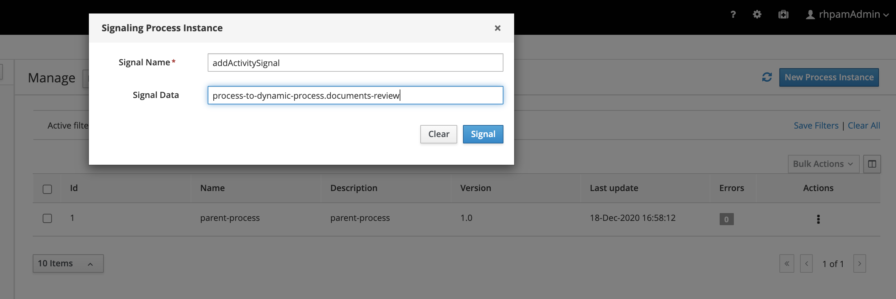

Process Instance from process and it's Life cycle
=================================================

This exmaple provides inforamtion about, how to create dynamic process instance from the process.

In this example we are using sub-process start the other processes dynamically.

Post deploying the kJar follow the the below steps.

* Step 1: Create a process instance for [parent-process]()
* Step 2: Signal created process instance with signal name and dyncamic process id as data to signal

* Step 3: Now observe the newly created process instance.

* Step 4: Repeat the step 2 for all other processes.

